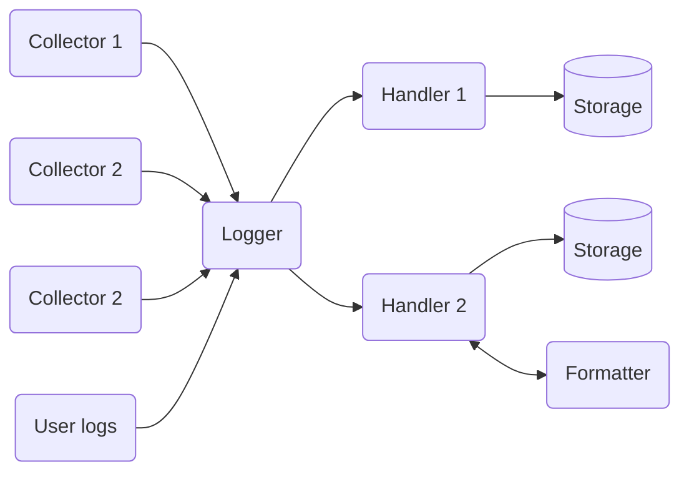

# General Debugr architecture

The Debugr core is very simple and only does a couple of things.
Most of the actual work is delegated to various plugins. This document
describes the core concepts of how the Debugr core works.

(todo: explain log entries, plugin types, log levels)

## Log Entries

Log entries are objects which represent data to be logged, along with some
additional metadata. Log entries can be _generic_, meaning the data has no
predefined semantics, or they can be _specialised_ to represent a specific
type of event or information. Whenever you call `logger.log()` or any of the
shortcuts a new log entry is created. Some plugins will produce entries
from e.g. a library they integrate with, and other plugins will consume
entries in order to produce some kind of output.

The shape of a log entry looks like this:

```typescript
export type LogEntry = {
  type?: EntryType;
  level: LogLevel;
  globalContext: TGlobalContext;
  taskContext?: TTaskContext;
  message?: string;
  data?: Record<string, any>;
  error?: Error;
  ts: Date;
};
```

The `Logger` class has an `add()` method, which expects an almost complete
log entry object - it will only supply the global and per-task context and
the timestamp. This method is typically used by plugins to log a _specialised_
log entry. The `log()` method (and its shortcuts) constructs a _generic_ log entry
from the supplied arguments and then delegates to `add()`. Notably, the `log()`
method will apply `printf`-style formatting to the log message, if a `[format, ...args]`
tuple is specified as the message. No other processing on the log entries is done
in either method - everything else happens in plugins.

## Log levels

The `LogLevel` type is a `const enum`, meaning that in the compiled code
any occurrences of any of its values are replaced by the values themselves.
This allows you to amend the definition with your own custom log levels like this:

```typescript
declare module '@debugr/core' {
  export const enum LogLevel {
    CUSTOM_WARNING = 35,
  }
}
```

**Important:** `const enum` types are mutually exclusive with the TypeScript
compiler option `isolatedModules`, which some transpilers (e.g. Babel) use.
This means that if you need this option enabled, you cannot use `const enum`
types. It is currently unclear how this can be worked around in Debugr context.

The predefined log levels in Debugr are:

 - `LogLevel.TRACE` (numeric value `0`)
 - `LogLevel.DEBUG` (numeric value `10`)
 - `LogLevel.INFO` (numeric value `20`)
 - `LogLevel.WARNING` (numeric value `30`)
 - `LogLevel.ERROR` (numeric value `40`)
 - `LogLevel.FATAL` (numeric value `50`)

## Entry types

Similarly to `LogLevel`, the `EntryType` enum is a `const enum`, so you can
define custom entry types in a similar fashion. There is a number of entry types
predefined in this manner in the `@debugr/*-common` packages. An entry type
is associated with an overloaded `LogEntry` type; each such overload specifies
a concrete shape for the `data` property. The currently defined entry types are:

 - `EntryType.HttpRequest` - used to denote a `HttpRequestLogEntry`, see
   [`@debugr/http-common`]
 - `EntryType.HttpResponse` - used to denote a `HttpResponseLogEntry`, see
   [`@debugr/http-common`]
 - `EntryType.GraphqlQuery` - used to denote a `GraphqlQueryLogEntry`, see
   [`@debugr/graphql-common`]
 - `EntryType.SqlQuery` - used to denote a `SqlQueryLogEntry`, see
   [`@debugr/sql-common`]

If you're writing a plugin which produces or consumes any of these entry types,
you should add a dependency on the appropriate `@debugr/*-common` package
and reuse the existing types if at all possible, rather than define your own types.

## Plugin types

Plugins in Debugr must conform to the `Plugin` interface exported from `@debugr/core`
or (more probably) one of its descendants. The base `Plugin` interface defines only
three things:

 - `public readonly id: string`: An identifier of the plugin. This must be unique
   to your plugin, otherwise it may lead to conflicts between plugin packages.
 - `public readonly kind: PluginKind`: A discriminator property denoting the plugin type.
   The `PluginKind` enum is a `const enum`, meaning you can define your own custom plugin
   types similarly to how you can define custom log levels and entry types. Like with
   entry types, a `PluginKind` value is associated with an interface derived from the
   generic `Plugin` interface, by convention named `<Type>Plugin` (e.g. `CollectorPlugin`).
   The built-in plugin types also provide type guards following the `is<Type>Plugin()` convention.
   If you want to define your own plugin type, it is highly recommended you stick to this
   convention.
 - `public injectLogger(logger: Logger, pluginManager: PluginManager): void`: This method
   will be called during Debugr initialisation. It allows plugins to get an instance of
   the `Logger`, as well as check which other plugins are registered in the plugin manager
   and optionally register more plugins they may require to work. More on this later.

There are three predefined plugin types at this time:

 - [**Collectors**]: Plugins which integrate Debugr with some kind of third party library
   or framework. They collect any relevant log entries from the 3rd party code and if applicable
   they may also start Debugr tasks for anything the library does which might be considered
   a task from Debugr's point of view.
 - [**Handlers**]: Plugins which consume log entries and persist them to some kind of storage.
   They may optionally employ Formatter plugins to convert entries to the storage format.
 - [**Formatters**]: These plugins convert log entries of a given type to a format expected
   by a given Handler.

## Data flow

The following diagram demonstrates how data flows inside Debugr:



The public API of the `Logger` class which user-land code will most often use is the `log()`
method or its shortcuts (`trace()`, `info()` and so on). The `log()` method simply constructs
a generic `LogEntry` and passes it to the `Logger.add()` method, which passes it on to all
configured handlers. Plugins will typically use a combination of `Logger.log()` for generic
entries and `Logger.add()` for specialised entries, but in the end, all entries must pass
through the `Logger.add()` method.


[`@debugr/http-common`]: ../packages/http-common
[`@debugr/graphql-common`]: ../packages/graphql-common
[`@debugr/sql-common`]: ../packages/sql-common
[**Collectors**]: ./collectors.md
[**Handlers**]: ./handlers.md
[**Formatters**]: ./formatters.md
