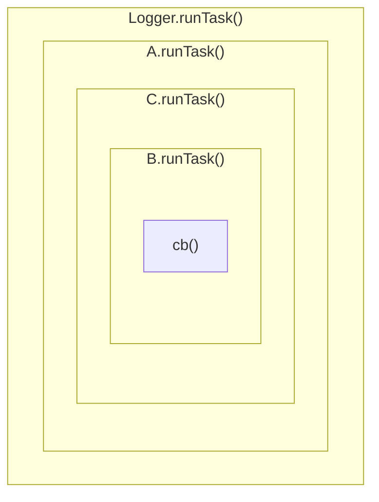

# Handler plugin development

The purpose of Handler plugins is to generate some kind of output from log entries.
This can mean writing some representation of the entries into a log file, or sending
the raw entries to an external service for further processing, or anything else, really.

## The `HandlerPlugin` interface

Each Handler plugin must implement the `HandlerPlugin` interface, which extends
the generic [`Plugin` interface] and adds the following methods and properties:

 - `public log(entry: LogEntry): Promise<void> | void`: This method will be called from
   `Logger.add()`. Whatever a handler wants to do with log entries is up to the handler.
   Note that unlike many other logging frameworks Debugr doesn't filter log entries
   by itself in any way - it passes _all_ entries to _all_ handlers, and it is up to the
   handlers to implement any relevant logic if they need to ignore some entries.
 - `public runTask?<R>(cb: () => R): R`: This optional method can be implemented by
   handlers which need to integrate with Debugr tasks, e.g. to wrap the task execution
   in their internal `AsyncLocalStorage` instance.

## Entry snapshots

One thing worth noting is that the call chain all the way from the public `Logger` API
methods through the semi-internal `add()` method down to the handlers' `log()` method is
_synchronous_, so whatever the handlers do _synchronously_ (until the first `await`)
within `log()` should be _fast_, otherwise it will slow down code executing at the calling
site. This is intentional on the part of Debugr: this way we can _guarantee_ that any mutable
data passed to Debugr will not be altered by user-land code before handlers get a chance
to process the data, or take a snapshot to be processed later. Consider the following:

```typescript
const user = await db.find(User, 'some id');

logger.info('Resolved user:', { user }); // 1

user.name = request.newName;             // 2
await db.persist(user);                  // 3

logger.info(['Renamed to "%s"', user.name]);
```

The `logger.info()` call at `1` will synchronously delegate to `logger.log()`, which
will also synchronously delegate to `logger.add()`, which, in turn, will synchronously
delegate to all registered handlers' `handler.log()`. Now imagine a Handler would perform
an asynchronous operation inside its `log()` before processing the passed log entry.
The execution of that handler's `log()` method would pause at the point of the first `await`
and the rest of the _synchronous_ code which was executing up to that point would continue
executing - so any remaining handlers' `log()` would be called, then `logger.add()` would
return, then `logger.log()` would return, then `logger.info()` would return and then the
line marked `2` would be executed, altering the `User` object, before execution of the original
synchronous code was paused at the `await` on line `3` (well, more precisely, somewhere
_within_ the `db.persist()` call). Only afterwards could the asynchronous code in the
handler's `log()` be resumed - but the `User` object contained in the log entry the handler
is still processing has already been mutated, and so the handler will incorrectly log
something roughly equivalent to `Resolved user: { name: "${request.newName}" }`.

So how do you avoid this? Well, if your handler serialises the entry in some way, e.g. to
send it over the wire to an external service, then the only thing you need to do is make
sure this serialisation takes place during the synchronous part of code execution, that is,
before the code stops to `await` something. But also note that when you `await someFunctionCall()`,
then the synchronous code _within_ `someFunctionCall()` also gets executed synchronously
at the point the function is called, and only when an `await` is encountered is execution
paused and a Promise is returned to be awaited on the previous level. Thus, for example,
the [Elastic handler] doesn't suffer from this issue, even though it doesn't explicitly
do anything to avoid it - because its `log()` method synchronously delegates to the Elastic
SDK's `index()` method, which, also synchronously, serialises the entire request payload
using `JSON.stringify()`. So there is no chance of user-land code possibly modifying the
entry data between the data entering Debugr internals and being serialised to be sent
to Elastic.

If your code _doesn't_ serialise the entry, your other option is to use the `clone()`
helper exported from `@debugr/core`. This function uses the V8 `serialize()` and `deserialize()`
functions, which are faster than `JSON.stringify()` and `JSON.parse()` and will also
be able to handle some native objects which cannot be represented with JSON (e.g. `Date`s).

## Output formatting

A handler usually either forwards the data elsewhere for further processing in some sort of
machine-readable format, or directly generates some kind of human-readable output. In the latter
case handlers can use Formatter plugins to generate rich semantic output from specialised
log entries. A Formatter plugin always translates exactly one specialised entry type into
format expected by exactly one Handler plugin. Packages providing a Handler plugin may optionally
also provide default Formatters for that specific Handler plugin and there is a utility in Debugr
core which simplifies some of the initial setup.

(todo: more info about how handlers _use_ formatters)

## Tasks

Handlers may or may not care about Debugr tasks. Handlers which do care need to implement
the `runTask()` method; this method will be called from within `Logger.runTask()`. When calling
`Logger.runTask()`, Debugr constructs a "Russian doll" out of all the handlers which implement
the `runTask()` method. Actual execution order of individual handlers' `runTask()` method is
not well-defined and shouldn't be important - but any individual handler's implementation of the
method will be called either by the `Logger` itself or by the previous handler in the chain,
and the callback passed as the first argument will either be the actual task, or a wrapper
calling the next handler in the chain. For example, let's say we have three handlers `A`, `B`
and `C` which all implement the `runTask()` method; then calling `Logger.runTask()` will do
something like this:



Usually handlers use this encapsulation mechanism to run the task within an `AsyncLocalStorage.run()`
context, but it might also make sense to do other things, like cleanup after a task is finished.

## Handler errors

(tbd)

[Elastic handler]: ../packages/elastic
