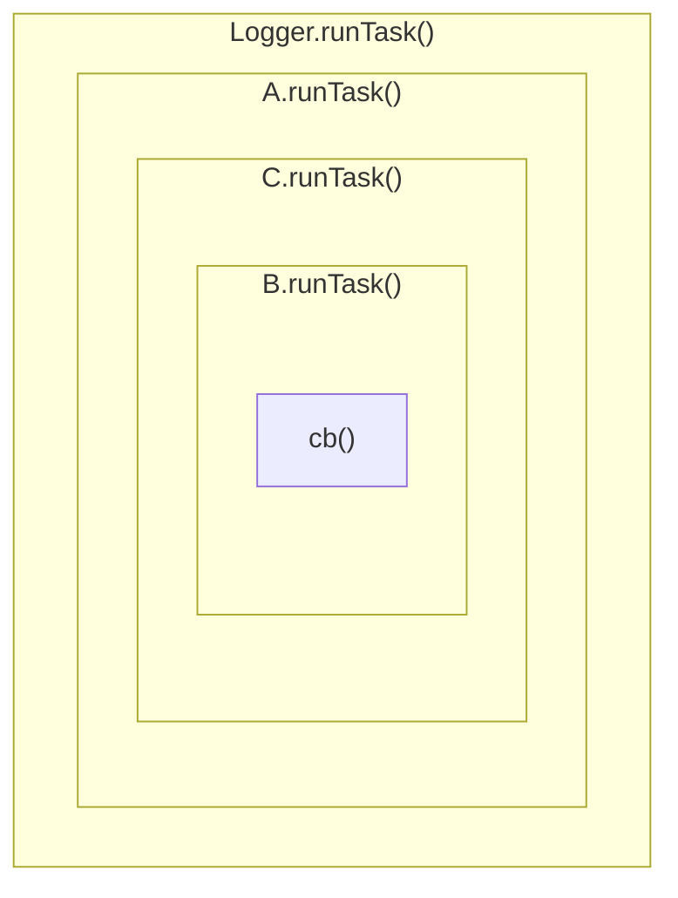

# Handler plugin development

The purpose of Handler plugins is to generate some kind of output from log entries.
This can mean writing some representation of the entries into a log file, or sending
the raw entries to an external service for further processing, or anything else, really.

## The `HandlerPlugin` interface

Each Handler plugin must implement the `HandlerPlugin` interface, which extends
the generic [`Plugin` interface] and adds the following methods and properties:

 - `public log(entry: LogEntry): Promise<void> | void`: This method will be called from
   `Logger.add()`. Whatever a handler wants to do with log entries is up to the handler.
   Note that unlike many other logging frameworks Debugr doesn't filter log entries
   by itself in any way - it passes _all_ entries to _all_ handlers, and it is up to the
   handlers to implement any relevant logic if they need to ignore some entries.
 - `public runTask?<R>(cb: () => R): R`: This optional method can be implemented by
   handlers which need to integrate with Debugr tasks, e.g. to wrap the task execution
   in their internal `AsyncLocalStorage` instance.

## Output formatting

A handler usually either forwards the data elsewhere for further processing in some sort of
machine-readable format, or directly generates some kind of human-readable output. In the latter
case handlers can use Formatter plugins to generate rich semantic output from specialised
log entries. A Formatter plugin always translates exactly one specialised entry type into
format expected by exactly one Handler plugin. Packages providing a Handler plugin may optionally
also provide default Formatters for that specific Handler plugin and there is a utility in Debugr
core which simplifies some of the initial setup.

Handlers which make use of Formatters will usually provide a default formatter for entry types
which don't have a specific Formatter provided either by the Handler package itself, or by
third-party plugins. For example the `@debugr/console` package provides a `DefaultConsoleFormatter`
plugin and four specialised formatters for HTTP requests and responses, GraphQL queries and
SQL queries. During Debugr initialisation the handler's `injectLogger()` method is called;
here the handler can examine all the registered Collector plugins to see which entry types it
should expect to receive and check if there are suitable Formatter plugins registered for them.
If a formatter for a given entry type is missing the handler can register it.

It sounds complicated, but there's a utility function exported from `@debugr/core` which does
most of the heavy lifting. In practice the code used to implement this functionality for
a hypothetical handler called `AwesomeHandler` might look like this:

```typescript
import type { FormatterPlugin, HandlerPlugin, Plugin, PluginManager, Logger, LogEntry } from '@debugr/core';
import { resolveFormatters } from '@debugr/core';

export interface AwesomeFormatter extends FormatterPlugin {
  targetHandler: 'awesome';

  doSomethingAwesome(entry: LogEntry): unknown;
}

// a map of entry types to factories which can create the appropriate formatters:
const defaultFormatters = {
  [EntryType.HttpRequest]: () => new HttpRequestAwesomeFormatter(),
  [EntryType.HttpResponse]: () => new HttpResponseAwesomeFormatter(),
  [EntryType.GraphqlQuery]: () => new GraphqlQueryAwesomeFormatter(),
  [EntryType.SqlQuery]: () => new SqlQueryAwesomeFormatter(),
};

// a type guard for the AwesomeFormatter interface
function isAwesomeFormatter(plugin: Plugin): plugin is AwesomeFormatter {
  return isFormatterPlugin(plugin) && plugin.targetHandler === 'awesome';
}

export class AwesomeHandler implements HandlerPlugin {
  defaultFormatter = new DefaultAwesomeFormatter();

  // ...

  injectLogger(logger: Logger, pluginManager: PluginManager): void {
    // the resolveFormatters() function will do all the logic described above for us,
    // and the result will be a map of entry type to AwesomeFormatter instance for that
    // entry type:
    this.formatters = resolveFormatters(pluginManager, isAwesomeFormatter, defaultFormatters);
  }

  log(entry: LogEntry): void {
    // get & use a specialised formatter, or fall back to the default:
    const formatter = entry.type && this.formatters[entry.type] || this.defaultFormatter;
    const formattedEntry = formatter.doSomethingAwesome(entry);
    // ...
  }
}
```

## Tasks

Handlers may or may not care about Debugr tasks. Handlers which do care need to implement
the `runTask()` method; this method will be called from within `Logger.runTask()`. When calling
`Logger.runTask()`, Debugr constructs a nested call chain out of all the handlers which implement
the `runTask()` method. Actual execution order of individual handlers' `runTask()` method is
not well-defined and shouldn't be important - but any individual handler's implementation of the
method will be called either by the `Logger` itself or by the previous handler in the chain,
and the callback passed as the first argument will either be the actual task, or a wrapper
calling the next handler in the chain. For example, let's say we have three handlers `A`, `B`
and `C` which all implement the `runTask()` method; then calling `Logger.runTask()` will do
something like this:



Usually handlers use this encapsulation mechanism to run the task within an `AsyncLocalStorage.run()`
context, but it might also make sense to do other things, like clean up after a task is finished
or update the task context data.

## Handler errors

There's a couple of conventional ways of dealing with errors thrown inside Handler plugins:
 - If a Formatter plugin fails to format an entry and it's not the default generic formatter,
   the handler can try formatting the entry using the default generic formatter and append
   some information about the fact. This is good when the only issue is formatting, since it
   means that the offending entry will still appear at the correct place in the log history.
 - If there is some kind of failure preventing the Handler from logging anything at all
   (e.g. readonly or inaccessible filesystem, network error etc.), then the Handler can simply
   log the error using the usual `Logger.log()` method (provided it keeps a reference to the
   Logger instance). In this case the entry should be logged at the `LogLevel.INTERNAL` level,
   which has a numeric value of `-1`. This will give other handlers an opportunity to log the
   error where it could otherwise be lost. If a Handler wants to log internal errors this way,
   it MUST implement some logic to prevent an infinite loop from occurring. One option is to use
   a `WeakSet` to keep track of errors logged from the handler itself and to ignore any entries
   which are already present in this set; take a look at the Elastic or Slack handlers' source
   for an example.
 - Obviously a Handler can also use any other means of handling internal errors - though it should
   adhere to some guiding principles:
   - Errors should rarely be ignored completely - at the very least, they should produce some
     console output.
   - Errors in Debugr should rarely cause the entire app to crash - Debugr should help _prevent_
     your app from crashing, after all.
   - Entries which _caused_ an error inside a handler have already been handled by other handlers,
     so there's no need to log them again when handling the error they caused.

[Elastic handler]: ../packages/elastic
